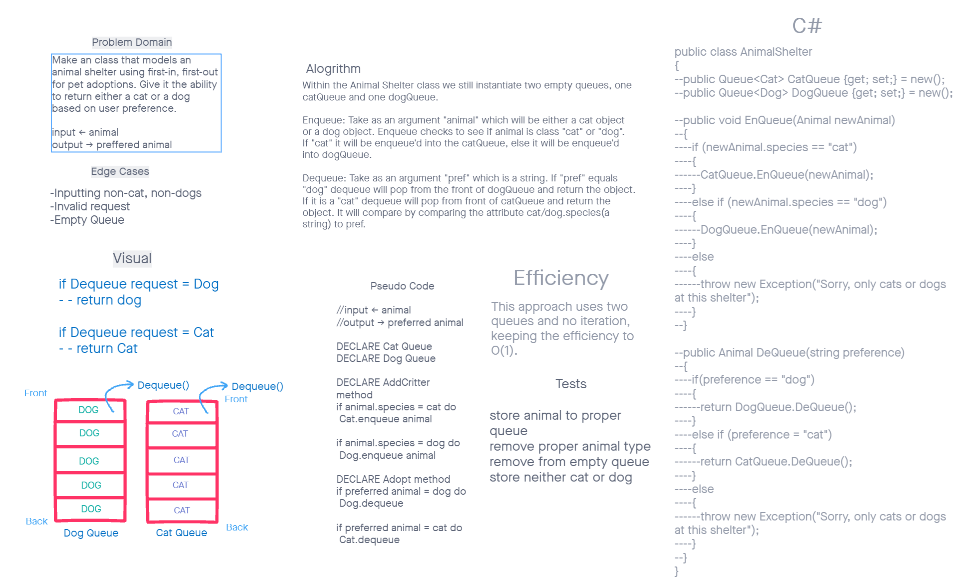

# Challenge Summary

Using previously established data structures, make an animal shelter that accepts both cats and dogs.

## WhiteBoard Process

## Approach & Efficiency
We made two queues, one for cats and one for dogs, with an IF statement on weither to add or take from either queue.
Big O(1)

## Solution
Run the tests? Not really sure what to put here.

[<==Back](../README.md)
