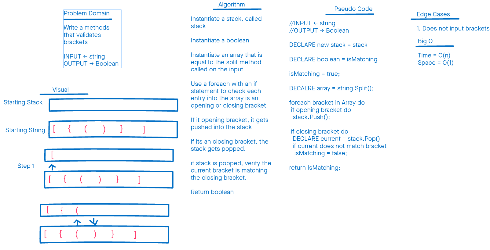

# Challenge Summary

Using previously established data structures, make a method that .

## WhiteBoard Process

## Approach & Efficiency
First we split the inputted string at each seperate character and store that to an array, we also have to instantiate a stack, and a boolean variable. Then using a for loop we iterate through the array. In each iteration of the loop, we use an if statement to store openning brackets in our stack. Any time we get a closing bracket, we pop off of the stack, to check if the bracket type matches the last thing we put on the stack. If it doesn't, we change our bool to false. After all this we return our bool.

## Solution
It works well in theory, but this is a weekend problem for me.

[<==Back](../README.md)
