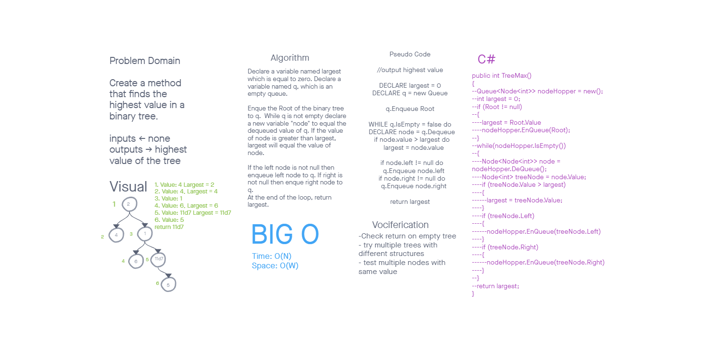

# Challenge Summary

Make a method that takes no arguments and itterates through a tree and returns the largest value.

## WhiteBoard Process

## Approach & Efficiency
For this challenge we thought the best way to traverse the tree would be with a level order traversal. The Big O for time is N, since each individual node takes the same amount of time to itterate. The big O for space is based on the width of the tree.

## Solution
Starting with the root, we add each node to a queue instantiated inside the method. We then dequeue our one node queue in a while loop with the break condition of the queue being empty. Each time we dequeue a node, we look for a right and a left property of the currently selected node, adding them to the end of the queue if they're present. We also check the value of the current node against a variable named largest that has been instantiated inside the method as well, setting the value of the current node to largest, if the current value is greater.

[<==Back](../README.md)
