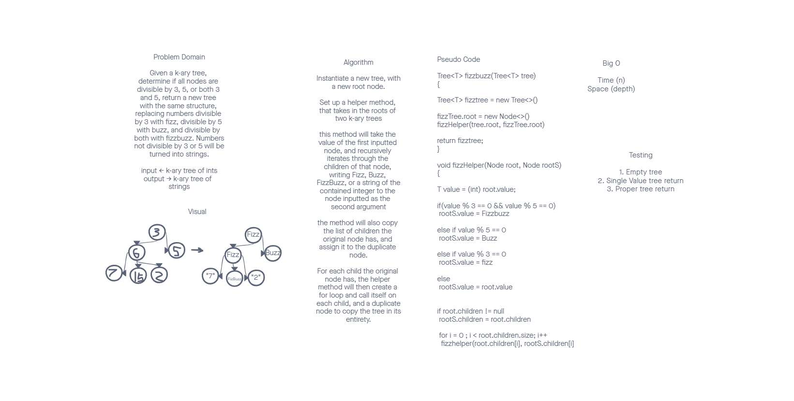

# Challenge Summary

Make a method that iterates through an input k-ary tree and makes a duplicate tree, where each integer node has been replaced with either a Fizz, if the integer was divisible by 3, Buzz, if the integer was divisible by 5, FizzBuzz if the integer was divisible by 3 and 5, or the same integer but as a string, if no other conditions were met.

## WhiteBoard Process

## Approach & Efficiency
We make a method that takes in a k-ary tree of integers, and make an empty tree. We then iterate through all the nodes and their children recursively with a helper method.
Big O for space is the height of the tree, Big O for time is N.

## Solution
Great in theory.

[<==Back](../README.md)
