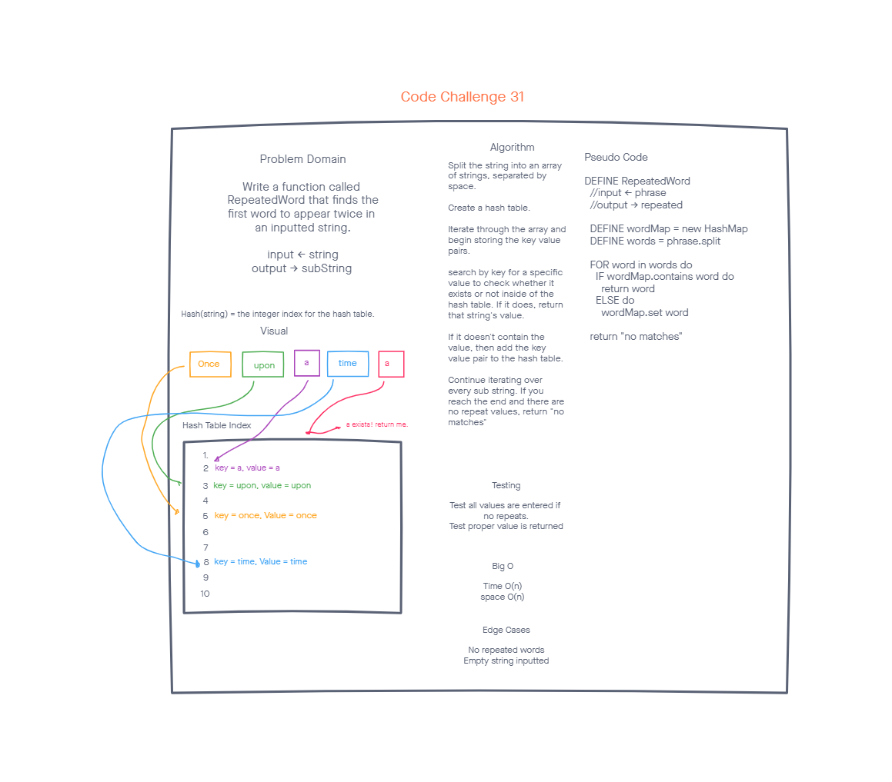

# Challenge Summary

Make a method that takes an inputted string, and returns the first word that's repeated twice.

## WhiteBoard Process

## Approach & Efficiency

We only use a hash table, string array, foreach, and an if statement in this method, making the big O for time O(n), and for space O(n).

## Solution

We make a method that instantiates a hash table, and an array of strings using the String.Split method, we then iterate through each word using a foreach to check if a word is already in the hash table, and return the word if it is, or to add it to the hash table if it isn't.

[<==Back](../README.md)
