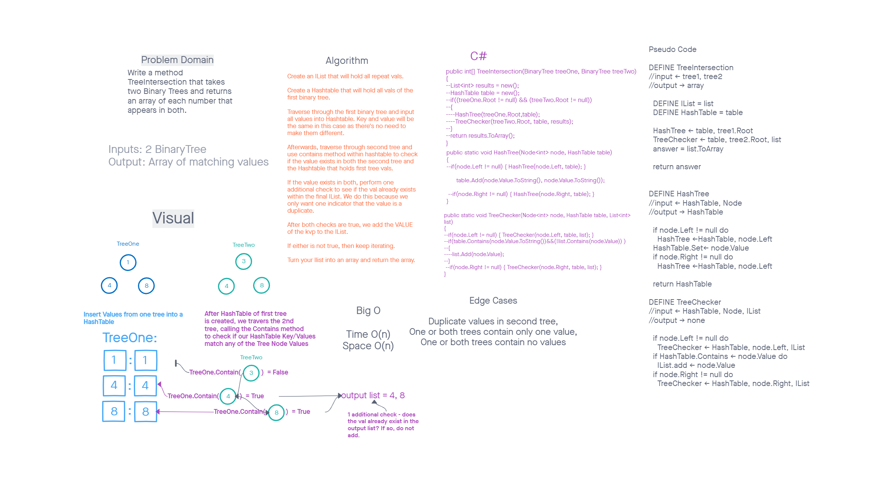

# Challenge Summary

Make a method that takes two inputted BinaryTrees, and returns an array of values that appear in both trees.

## WhiteBoard Process

## Approach & Efficiency

We use a hash table to store all values in the first tree, then check all values in the second tree against the hash table, adding the values to a list if they're present in the table. We then use the ToArray method on the list and return that. Big O of time is O(n), space is also O(n)

## Solution

We instantiate a list and a hashTable right off the bat, before utilizing a helper method to traverse the first tree in order, adding every value present in the tree to the hash table. We then iterate recursively through the second tree, with a second helper method, checking if each value is present in the hashTable, and adding it to the list if it is. Lastly we use the ToArray method on the list, and return it.

[<==Back](../README.md)
