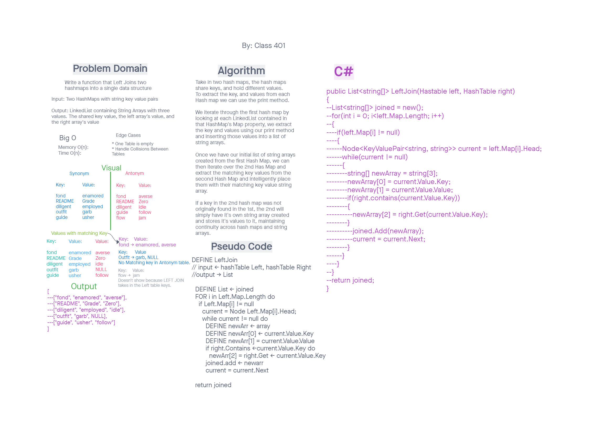

# Challenge Summary

Make a method that takes two inputted HashMaps, and returns a structure where keys that appear in both trees have all values stored in them.

## WhiteBoard Process

## Approach & Efficiency

First we check the first Table for all its keys, then we check the second map for all the keys in there. The Big O for both time and space is O(n).

## Solution

First we iterate through one HashTable, adding all of it's values to a list as an array. We check the key of this first HashTable, to check if it's in the second HashTable. If the second HashTable contains the key we're searching for, we extend the array, and add the value from the second HashTable. We then return the list.

[<==Back](../README.md)
